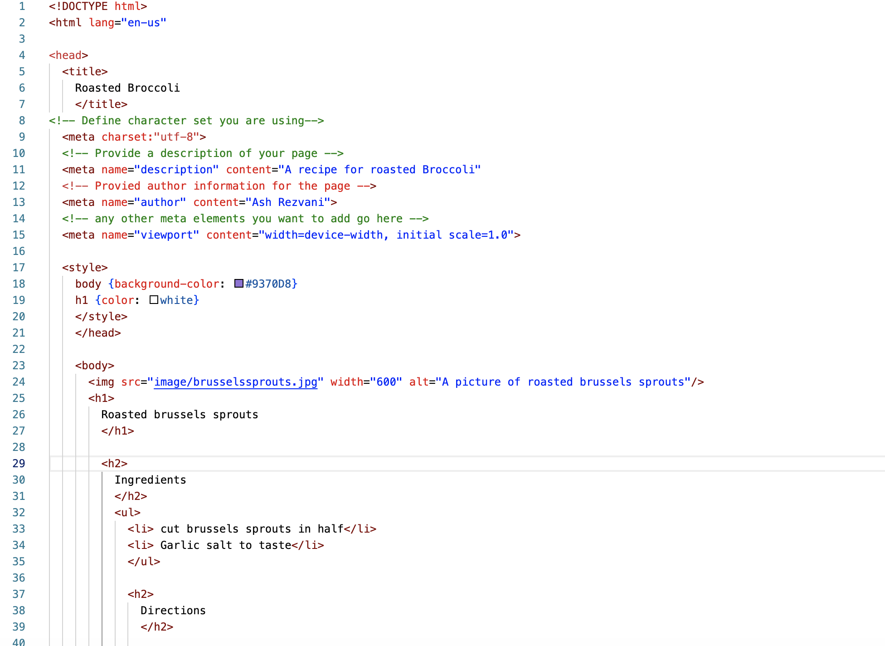
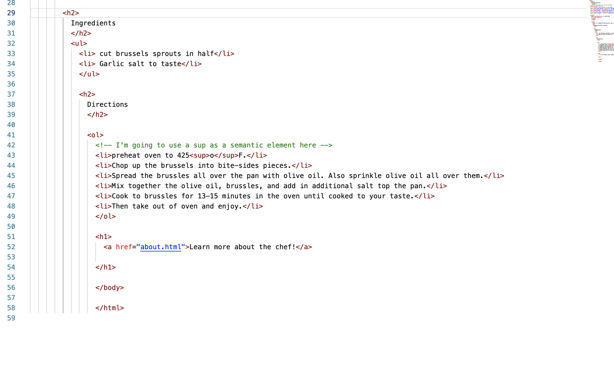
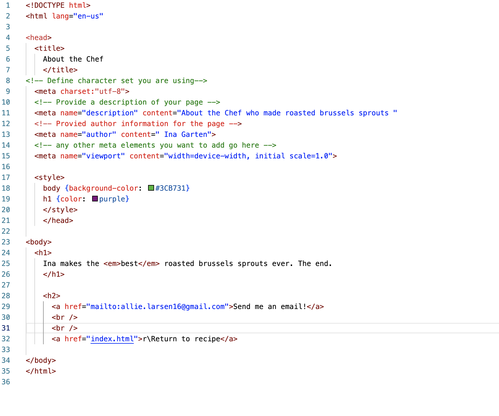

Describe the difference between structural and semantic markup
A semantic element is used to describe what the element is about where as structural elements are used to describe how the content that you are embedding is related to the pther content within the document. 
 
 
 
 