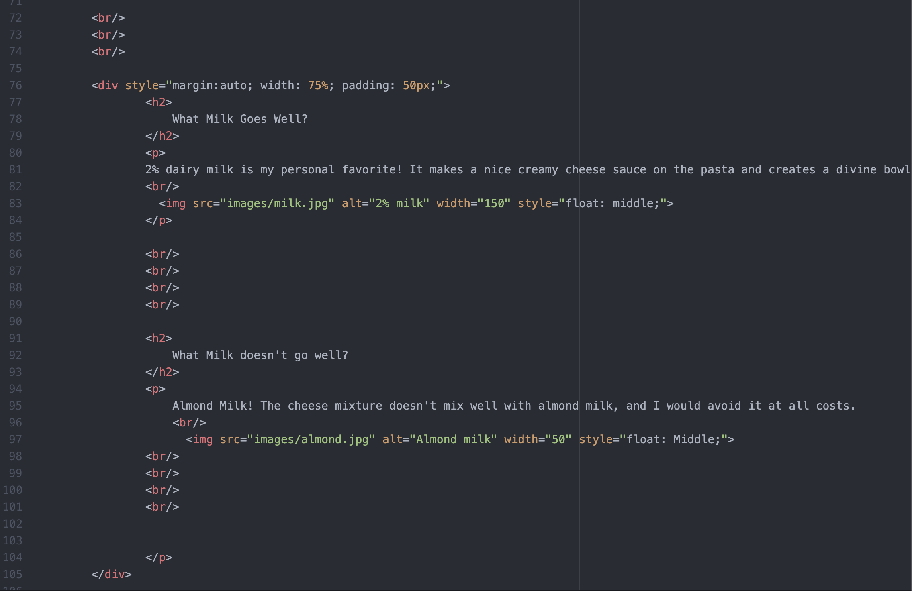

Briefly recap your experience learning HTML. What was old, new, interesting, or difficult to learn?
In my experience learning HTML the process of setting up the HTML file got old, but the whole experience as a whole was super interesting. The thing that I found most difficult to learn was the process of putting images into my html file. If one little thing was wrong, it would make my entire image seem wrong, which I struggled with.
After we come back from spring break we will start to dive into CSS and expand on styling, which helps us "decorate" HTML. Is there anything you're anxious or excited to learn about in this new section?
NO not really. My dad is very into computer programming, so he has talked about CSS before, so I am super excited to learn about it!

