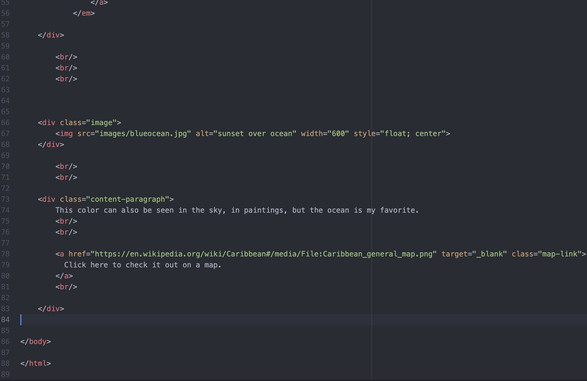

1) Typography is a way the designers make written language readable and apealing to the eye when it's displayed on the website.
2) Fallback fonts are important because they make sure that the webpage is legible. This is how a designer would organize their fonts.
3) System Font: is a font that is already installed
Web font: is a font that is not already installed, but can be downloaded from the brower.
Web-safe fonts: are fonts that are common and safe to use on the wev. These fonts like system fonts are likely already installed on the users device as well.

 
   
    
     
      
       
        
