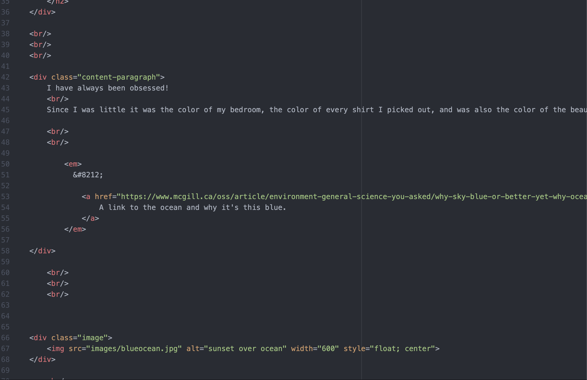
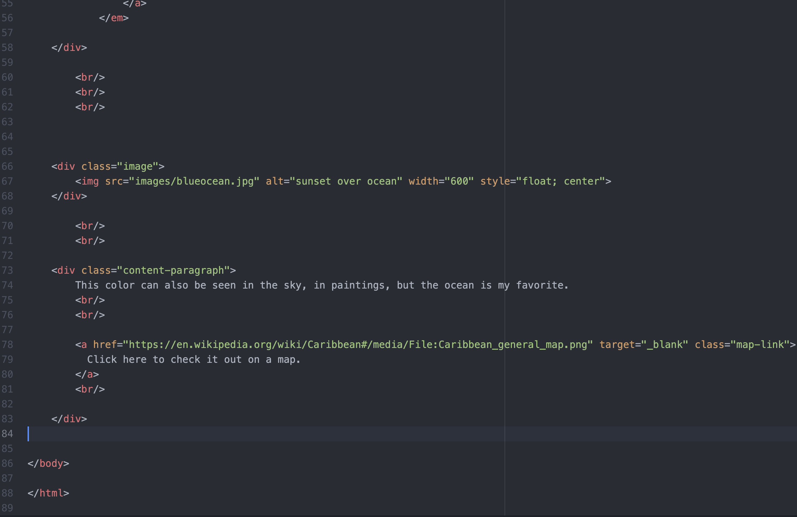
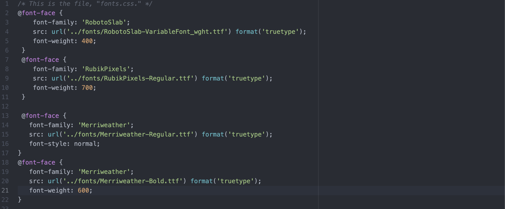
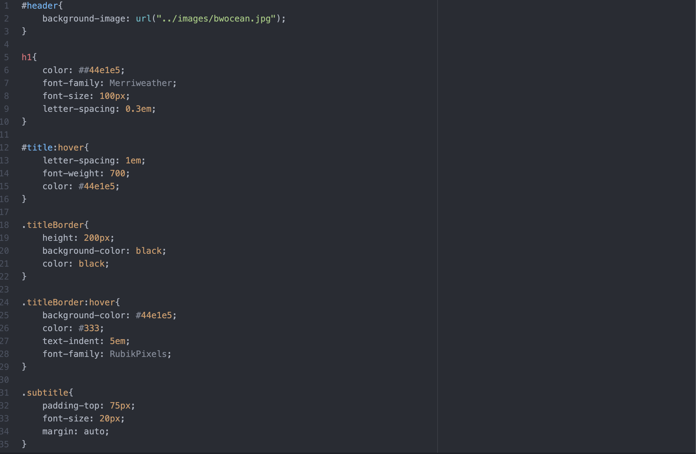
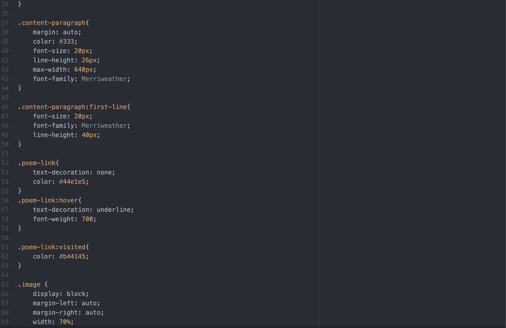
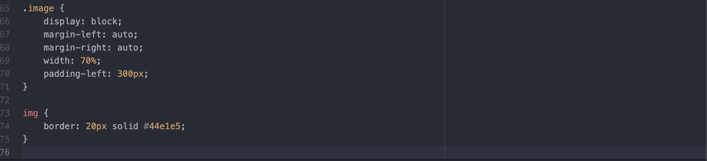
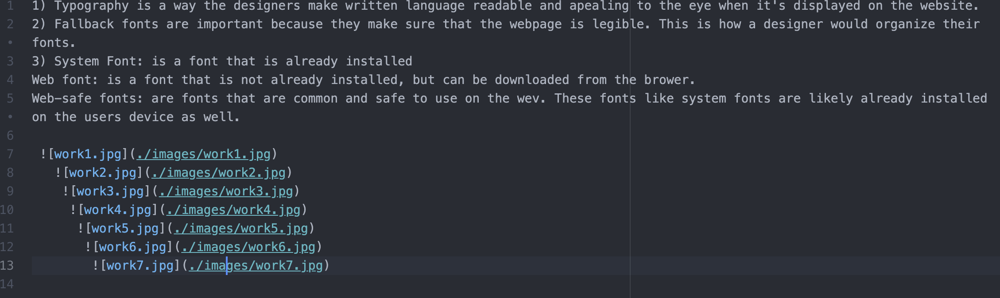

1) Typography is a way the designers make written language readable and apealing to the eye when it's displayed on the website.
2) Fallback fonts are important because they make sure that the webpage is legible. This is how a designer would organize their fonts.
3) System Font: is a font that is already installed
Web font: is a font that is not already installed, but can be downloaded from the brower.
Web-safe fonts: are fonts that are common and safe to use on the wev. These fonts like system fonts are likely already installed on the users device as well.

 
   
    
     
      
       
        
        

    
    
    
    
    
    

  What is the difference between padding, margin, and borders?

    Padding is the space between an elements content and its border. Padding can be applied to all sides of an element or to a specific side.

    Margin is the space outside of the elements border. This can be used to add space between elements. It can also be applied to all sides of the element.

    Borders are lines and boundaries that surround the element. They are used in a visual way to seperate one element from another. You can design borders however you want them to be displayed.
