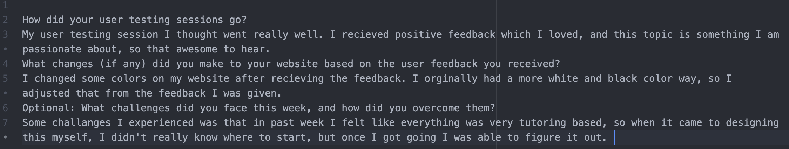

How did your user testing sessions go?
My user testing session I thought went really well. I recieved positive feedback which I loved, and this topic is something I am passionate about, so that awesome to hear.
What changes (if any) did you make to your website based on the user feedback you received?
I changed some colors on my website after recieving the feedback. I orginally had a more white and black color way, so I adjusted that from the feedback I was given.
Optional: What challenges did you face this week, and how did you overcome them?
Some challanges I experienced was that in past week I felt like everything was very tutoring based, so when it came to designing this myself, I didn't really know where to start, but once I got going I was able to figure it out.

