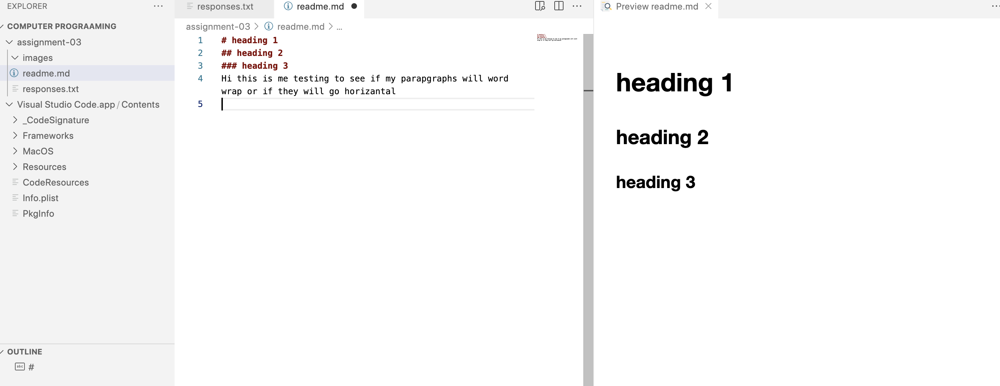

# heading 1
## heading 2
### heading 3
Hi this is me testing to see if my parapgraphs will word wrap or if they will go horizantal
[click here](https://www.amazon.com/?tag=amazusnavi-20&hvadid=381823327651&hvpos=&hvnetw=g&hvrand=13520727744267295082&hvpone=&hvptwo=&hvqmt=e&hvdev=c&hvdvcmdl=&hvlocint=&hvlocphy=9060556&hvtargid=kwd-10573980&ref=pd_sl_7j18redljs_e&hydadcr=28883_11845442&gclid=Cj0KCQiA54KfBhCKARIsAJzSrdo2SkhTsrXJD4oN-ENNsT-nYpXt4fFidLzO7UQ1X4jYtIUWGPI7rIcaAjV8EALw_wcB)
[my file](./responses.txt)

Tell me three things you have learned in this class so far.
So far I have learned what a URL is, how to work grithib, and how to program a picture into this program.