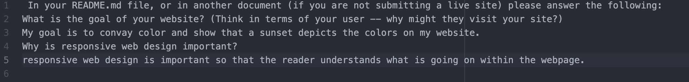

 In your README.md file, or in another document (if you are not submitting a live site) please answer the following:
What is the goal of your website? (Think in terms of your user -- why might they visit your site?)
My goal is to convay color and show that a sunset depicts the colors on my website.
Why is responsive web design important?
responsive web design is important so that the reader understands what is going on within the webpage.
 
